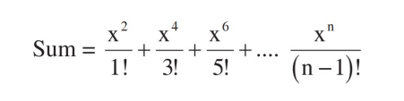

#### Printing data & Taking Input from a user
```java
package com.mycompany.mavenproject3;

import java.util.Scanner;

/**
 *
 * @author sa1tama0
 */
public class Mavenproject3 {

    public static void main(String[] args) {
        // Simple Output
        System.out.println("Simple Output");
        // Taking Input from User's
        Scanner in = new Scanner(System.in);
        int inputx = in.nextInt();
        System.out.println(inputx + " is user input.");
    }
}
```
#### Taking int, float, double, boolean data from user.
```java
package com.mycompany.mavenproject3;
import java.util.Scanner;
/**
 *
 * @author sa1tama0
 */
public class Mavenproject3 {
    public static void main(String[] args) {
    
        Scanner data = new Scanner(System.in);
        System.out.println("Enter the Integer : ");
        int a = data.nextInt();
        System.out.println(a + " here is your integer data.");
        
        System.out.println("Enter the Float : ");
        float b = data.nextFloat();
        System.out.println( b +" here is your float data.");
        
        System.out.println("Enter the Float : ");
        double c = data.nextDouble();
        System.out.println(c +" here is your double data.");
        
        System.out.println("Enter the Float : ");
        boolean d = data.nextBoolean();
        System.out.println(d +" here is your boonlean data.");
    }
}
```
#### Multiplication & Factorial
```java
package com.mycompany.mavenproject3;
import java.util.Scanner;
/**
 *
 * @author sa1tama0
 */
public class Mavenproject3 {
    
    public void Multiple(int a)
    {
        for(int i=1;i<=10;i++)
        {
            System.out.println(a + " * " + i + " = "+ a*i);
        }
    }
    public void Factorial(int b)
    {
        int j=1;
        for(int i=1;i<=b;i++)
        {
            j = j*i;
        }
        System.out.println(j);
    }
    public static void main(String[] args) {
        System.out.println("Enter the integer data :");
        // Take data from user
        Scanner data = new Scanner(System.in);
        int x=data.nextInt();
        // Creating an object for accessing the function
        Mavenproject3 obj = new Mavenproject3();
        obj.Multiple(x);
        System.out.println("Factorial of " +x+ " : ");
        obj.Factorial(x);
    }
}
```
#### Summation of Factorial odd number.

```java
package com.mycompany.mavenproject3;
import java.util.Scanner;
/**
 *
 * @author sa1tama0
 */
public class Mavenproject3 {
    public double Factorial(int b)
    {
        int j=1;
        for(int i=1;i<=b;i++)
        {
            j = j*i;
        }
        return j;
    }
    public void summ(int a,int b)
    {
        int i,j;
        double x,y,result = 0;
        for (i=2; i<=b; i=i+2)
        {
            x = Math.pow(a, i);
            j= i-1;
            // Non-static function don't need an object to call them
            y = Factorial(j);
            result = result + (x/y);
        }
        System.out.println(result);
    }
    public static void main(String[] args) {
        Scanner data = new Scanner(System.in);
        System.out.println("Enter the integer data :");
        int x=data.nextInt();
        System.out.println("Enter the integer data :");
        int y=data.nextInt();
        Mavenproject3 obj = new Mavenproject3();
        obj.summ(x,y);
    }
}
```
